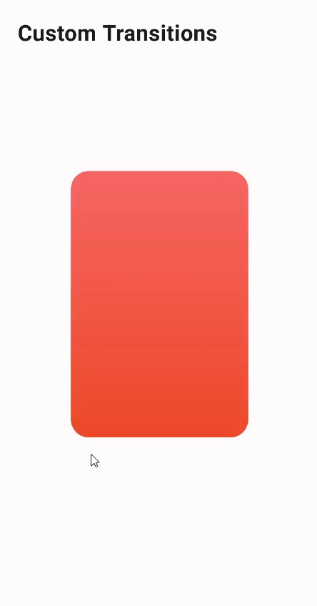

# Custom Transitions Jetpack Compose

Welcome to the Custom Transitions Jetpack Compose repository! This project is dedicated to exploring and demonstrating how to create custom animations and transitions in Android apps using Jetpack Compose. Jetpack Compose simplifies UI development on Android with less code, powerful tools, and intuitive Kotlin APIs. This repository serves as a practical reference for developers interested in adding smooth and responsive animations to their Compose applications.

## 🚀 About This Project

Animations greatly enhance the user experience, making UI interactions smooth and engaging. In this repository, we focus on custom transitions based in this [X post](https://x.com/androiddevnotes/status/1781708316609048845) 

## 🛠️ Getting Started

These instructions will get you a copy of the project up and running on your local machine for development and testing purposes. Follow these simple steps to start using and contributing to Custom Transitions Jetpack Compose.

### Prerequisites

Before you begin, ensure you have the following tools installed on your system:

- [Git](https://git-scm.com/downloads)
- [Android Studio](https://developer.android.com/studio) (Arctic Fox or later recommended for optimal Jetpack Compose support)

### Installation

1. **Clone the repository**

   Use Git to clone the project's repository to your local machine. Open a terminal and run the following command:

   `git clone https://github.com/devstromo/custom_transitions_jetpack_compose.git`

2. **Open the project in Android Studio**

   Open Android Studio, select 'Open an existing project', and navigate to the folder where you cloned the repository.

3. **Sync the Project with Gradle Files**

   Ensure all dependencies are correctly synced by Android Studio. If there are any issues, try reloading the project or restarting Android Studio.

4. **Run the Application**

   Use the Android emulator or a physical device to run the application. This can be done by selecting 'Run' -> 'Run 'app'' from the menu, or using the 'Shift + F10' shortcut.

## 📄 License

This project is licensed under the GNU General Public License v3.0 (GPL-3.0) - see the [LICENSE](LICENSE) file for details.

The GPL license guarantees users the freedom to run, study, share, and modify the software. The GPLv3 also protects these freedoms legally for everyone, ensuring that they cannot be legally turned into proprietary restrictions. GPL-licensed works, modifications, and larger works based on them must also be licensed under the GPL, keeping the software free and open.

For more information on the specifics of the GNU General Public License v3.0, please refer to the official [GPL-3.0 License](https://www.gnu.org/licenses/gpl-3.0.en.html) documentation.
